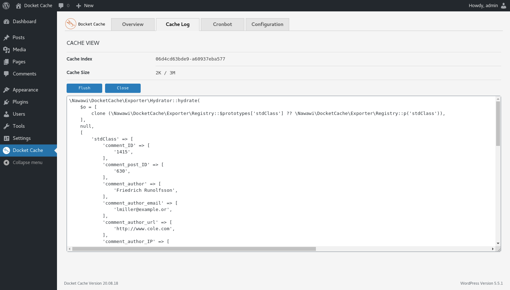
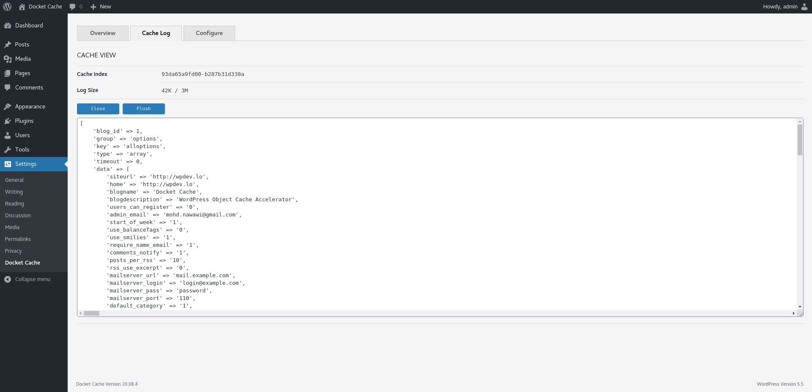

#  Docket Cache
 

A persistent object cache stored as a plain PHP code, accelerates caching with OPcache backend.

## Description

The Docket cache is a persistent WordPress Object Cache that is stored as a plain PHP code. Intends to provide an alternative option for those who can't use Redis or Memcached server.

Rather than using [serialize](https://www.php.net/manual/en/function.serialize.php) and [unserialize](https://www.php.net/manual/en/function.unserialize.php) a PHP object to store into flat files, this plugin stores data by converting the object into plain PHP code which results in faster data retrieval and better performance with Zend OPcache enabled.

Kindly refer to the WordPress documentation on [Object Cache](https://make.wordpress.org/hosting/handbook/handbook/performance/#object-cache).

## Why use this plugin?
When it comes to reliable persistent Object Cache in WordPress, [Redis](https://redis.io/) or [Memcached](https://memcached.org/) comes on top. However, those solutions require knowledge of server and rarely available at low cost or shared hosting servers

The only solution is to store the object caches into files. With WordPress, exporting the PHP objects are not easy, most plugin that implements file-based solution will serialize and unserialize the object to store and retrieve the data.

The Docket Cache is better because it converts the object cache into plain PHP code. This solution is faster since WordPress can use the cache directly without running other operation.

## Installation

To use Docket Cache require minimum PHP 7.2.5, WordPress 5.4 and Zend OPcache for best performance.

Please see the [installation wiki](https://github.com/nawawi/docket-cache/wiki/Installation) page for details.

## Configuration Options

The Docket Cache uses constants variable as main configuration methods.

To adjust the plugin behavior, please see the [configuration wiki](https://github.com/nawawi/docket-cache/wiki/Constants) page for details.

## WP-CLI Commands

You can manage this plugin through command line when activated.

To use the WP-CLI commands, please see the [WP-CLI wiki](https://github.com/nawawi/docket-cache/wiki/WP-CLI) page for available commands.

## Screenshots
 Plugin Overview.

 Cache Log.

 Configuration.

 Select log to view.

 Cache view.

## How Versions Work

Versions are as follows: Year.Month.Day

* Year: Two digits representation of a year.
* Month: Two digits representation of a month.
* Day: Two digits representation of a day.

## Contributions

Anyone can contribute to Docket Cache. Please do so by posting issues when you've found something that is unexpected or sending a pull request for improvements.

- [Report issues](https://github.com/nawawi/docket-cache/issues)
- [Send Pull requests](https://github.com/nawawi/docket-cache/pulls)

## Thanks

- Thanks to [GitHub](https://github.com) for hosting the code and a provides a good infrastructure.
- Thanks to [Symfony Components](https://github.com/symfony) for release and maintaining reusable code.
- Thanks to [WordPress.org](https://wordpres.org) for beautiful designs, powerful features, and the freedom to build anything we want.
- Thank you to all who have contributed to this plugin.

## License

Docket cache is open-sourced software licensed under the [MIT license](https://github.com/nawawi/docket-cache/blob/master/LICENSE.txt).
