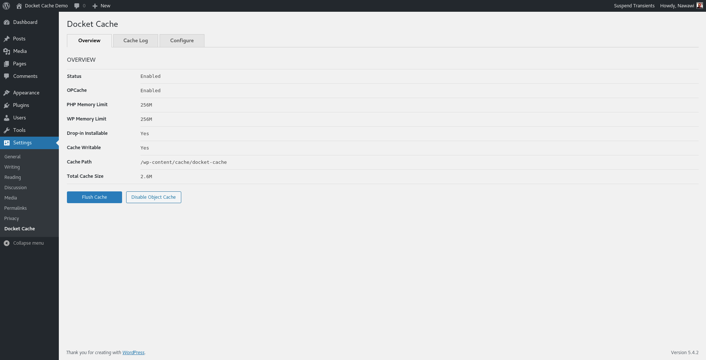
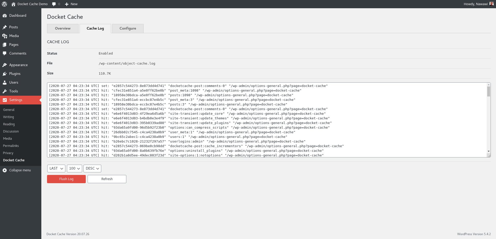
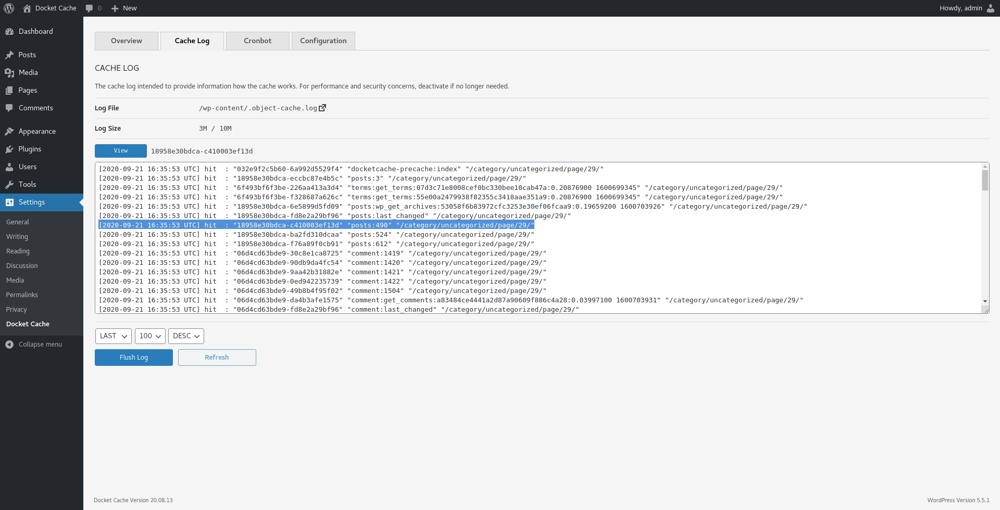

#  Docket Cache

A file-based persistent WordPress Object Cache stored as a plain PHP code.
  
## Description

The Docket cache is a file-based persistent WordPress Object Cache that is stored as a plain PHP code. Intends to provide an alternative option for those who can't use Redis or Memcached server.

Rather than using [serialize](https://www.php.net/manual/en/function.serialize.php) and [unserialize](https://www.php.net/manual/en/function.unserialize.php) a PHP object to store into flat files, this plugin stores data by converting the object into plain PHP code which results in faster data retrieval and better performance with PHP OPCache enabled.

Kindly refer to the WordPress documentation on [Object Cache](https://make.wordpress.org/hosting/handbook/handbook/performance/#object-cache).

## Why use this plugin?
When it comes to reliable persistent Object Cache in WordPress, [Redis](https://redis.io/) or [Memcached](https://memcached.org/) comes on top. However, those solutions are not available to low cost or shared hosting servers.

The only solution is to store the object caches into files. With WordPress, exporting the PHP objects are not easy, most plugin that implements file-based solution will serialize and unserialize the object to store and retrieve the data.

The Docket Cache is better because it converts the object cache into plain PHP code. This solution is faster since WordPress can use the cache directly without running other operation.

## Installation

To use Docket Cache require minimum PHP 7.2.5, WordPress 5.4 and PHP OPCache for best performance.

### WordPress Plugin Directory
1. In your WordPress admin click *Plugins -> Add New*
2. Search plugins ["Docket Cache"](https://wordpress.org/plugins/docket-cache/) and click Install Now.
3. Click *Activate* or *Network Activate* in Multisite setups.
4. Enable the object cache under Settings -> Docket Cache, or in Multisite setups under Network Admin -> Settings -> Docket Cache.

### Manual Installation
 1. Download the plugin as a [ZIP file](https://github.com/nawawi/docket-cache/archive/master.zip) from GitHub.
 2. In your WordPress admin click *Plugins -> Add New -> Upload Plugin*.
 3. Upload the ZIP file and Activate the plugin.
 4. Enable the object cache under *Settings -> Docket Cache*, or in Multisite setups under *Network Admin -> Settings -> Docket Cache*.

### Via WP-CLI

[`WP-CLI`](http://wp-cli.org/) is the official command-line interface for WordPress. You can install `docket-cache` using the `wp` command like this:

```
wp plugin install --activate https://github.com/nawawi/docket-cache/archive/master.zip --force
```

### Via Composer
The plugin is available as [Composer package](https://packagist.org/packages/nawawi/docket-cache) and can be installed via Composer from the root of your WordPress installation.
```
composer create-project -s dev --prefer-dist nawawi/docket-cache wp-content/plugins/docket-cache
```

### Via Git
Go to your WordPress plugins folder `cd wp-content/plugins`
```
git clone https://github.com/nawawi/docket-cache
```

### Automatic Update
Besides WordPress's auto-update feature, Docket Cache supports the [GitHub Updater plugin](https://github.com/afragen/github-updater) WordPress. The plugin enables automatic updates from this GitHub Repository. You will find all information about the how and why at the [plugin wiki page](https://github.com/afragen/github-updater/wiki).


## Configuration Options

To adjust the configuration, define any of the following constants in your `wp-config.php` file.

**`DOCKET_CACHE_DISABLED`**

Set to `true` to disable the object cache at runtime.  
Default:
```php
define('DOCKET_CACHE_DISABLED', false);
```

**`DOCKET_CACHE_MAXTTL`**

Maximum cache time-to-live in seconds, if expiry key `0`.   
Default:
```php
define('DOCKET_CACHE_MAXTTL', 0); 
```
**`DOCKET_CACHE_GLOBAL_GROUPS`**

Lists of cache groups that share cache with other sites in a Multisite setup.
Default:
```php
define('DOCKET_CACHE_GLOBAL_GROUPS',
  [
    'blog-details',
    'blog-id-cache',
    'blog-lookup',
    'global-posts',
    'networks',
    'rss',
    'sites',
    'site-details',
    'site-lookup',
    'site-options',
    'site-transient',
    'users',
    'useremail',
    'userlogins',
    'usermeta',
    'user_meta',
    'userslugs'
  ]
);
```

**`DOCKET_CACHE_IGNORED_GROUPS`**

List of cache groups that should not be cached.  
Default:
```php
define('DOCKET_CACHE_IGNORED_GROUPS',
  [
    'counts',
    'plugins',
    'themes'
  ]
);
```

**`DOCKET_CACHE_PATH`** 

Set the cache directory.
Default:
```php
define('DOCKET_CACHE_PATH`', WP_CONTENT_DIR.'/cache/docket-cache');
```

**`DOCKET_CACHE_LOG`**

Set to `true` to enable cache log.  
Default:
```php
define('DOCKET_CACHE_LOG', false);
```

**`DOCKET_CACHE_LOG_FILE`**

Set the log file.
Default:
```php
define('DOCKET_CACHE_LOG_FILE`', WP_CONTENT_DIR.'/object-cache.log');
```

**`DOCKET_CACHE_LOG_FLUSH`**

Set to `true` to empty the log file when the object cache is flushed.  
Default:
```php
define('DOCKET_CACHE_LOG_FLUSH', true);
```

**`DOCKET_CACHE_LOG_SIZE`**

Set the maximum size of a log file in bytes. Default set to 10MB.  
Default:
```php
define('DOCKET_CACHE_LOG_SIZE', 10000000);
```

**`DOCKET_CACHE_FLUSH_DELETE`**

By default Docket Cache only empty the cache file. Set to true to delete the cache file.  
Default:
```php
define('DOCKET_CACHE_FLUSH_DELETE', false);
```

**`DOCKET_CACHE_GC`**

The Docket Cache Garbage collector is scheduled to run every 30 minutes to clean empty files that are more than 2 minutes old. Set to false to disable the garbage collector.  
Default:
```php
define('DOCKET_CACHE_GC', true);
```

**`DOCKET_CACHE_ADVCPOST`**

Set to true to enable Advanced Post Cache.  
Default:
```php
define('DOCKET_CACHE_ADVCPOST', true);
```

**`DOCKET_CACHE_MISC_TWEAKS`**

Set to true to enable miscellaneous WordPress performance tweaks.  
Default:
```php
define('DOCKET_CACHE_MISC_TWEAKS', true);
```

**`DOCKET_CACHE_PRELOAD`**

Set to true to enable cache preloading.  
Default:
```php
define('DOCKET_CACHE_PRELOAD', false);
```

## WP-CLI Commands

To use the WP-CLI commands, make sure the plugin is activated:
```
wp plugin activate docket-cache
```

The following commands are supported:

  * `wp cache status`

    Show the Docket object cache status.

  * `wp cache enable`

    Enables the Docket object cache. Default behavior is to create the object cache drop-in unless an unknown object cache drop-in is present.

  * `wp cache disable`

    Disables the Docket object cache. The default behavior is to delete the object cache drop-in unless an unknown object cache drop-in is present.

  * `wp cache update`

    Updates the Docket object cache drop-in. The default behavior is to overwrite any existing object cache drop-in.

  * `wp cache flush`

    Flushes the object cache.

  * `wp cache preload`

    Run cache preload.

## Screenshots






## How Versions Work

Versions are as follows: Year.Month.Day

* Year: Two digits year of release.
* Month: Two digits month of release.
* Day: Two digits day of release.


## Contributions

Anyone can contribute to Docket Cache. Please do so by posting issues when you've found something that is unexpected or sending a pull request for improvements.

- [Report issues](https://github.com/nawawi/docket-cache/issues)
- [Send Pull requests](https://github.com/nawawi/docket-cache/pulls)

## License

Docket cache is open-sourced software licensed under the [MIT license](https://github.com/nawawi/docket-cache/blob/master/LICENSE.txt).
